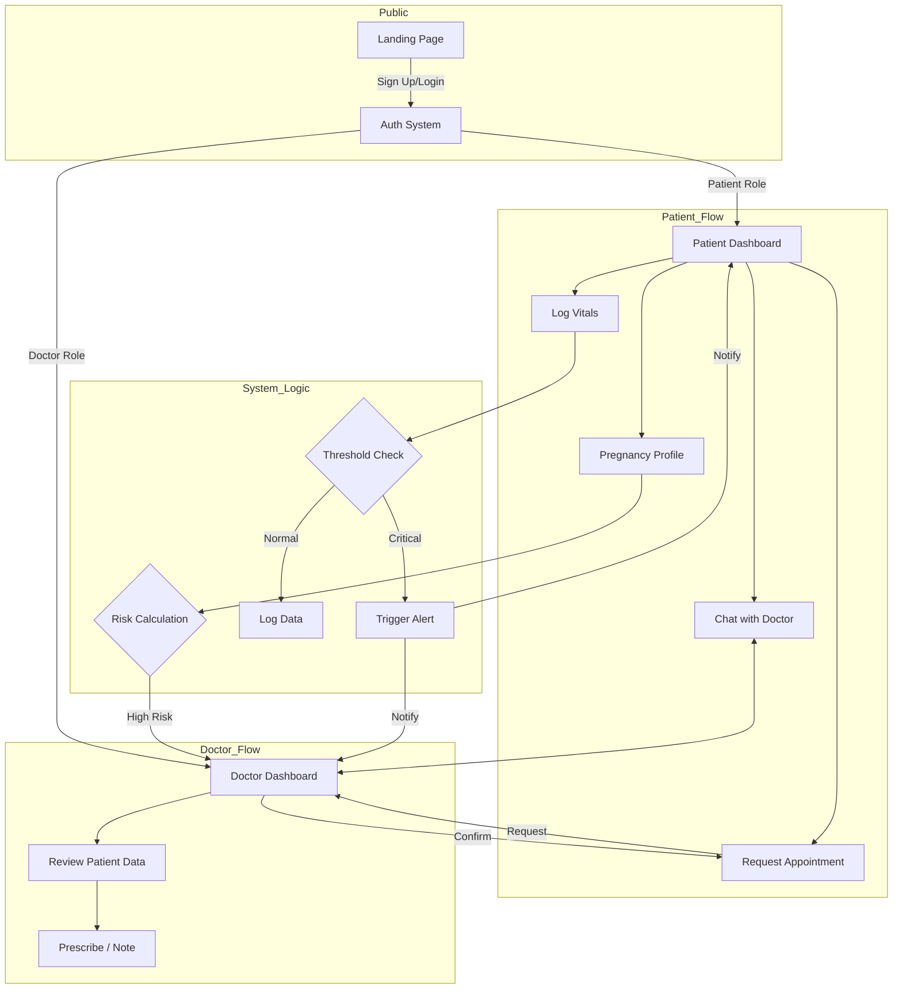

# Project Workflow & User Journeys

## High-Level Workflow Overview
The PrenatalCare platform connects three key stakeholders: **Patients**, **Doctors**, and **Admins**. The workflow centers around the pregnancy journey, from initial registration to postpartum care.

## 1. User Registration & Onboarding
- **Patient Journey:**
    1.  User visits Landing Page -> Clicks "Get Started".
    2.  Registers as Patient -> Creates Profile (Medical History, Due Date).
    3.  System calculates current week & risk profile.
    4.  Redirects to **Patient Dashboard**.
- **Doctor/Admin Journey:**
    1.  Admin creates/invites Doctor accounts.
    2.  Doctor logs in -> Sets up schedule & availability.

## 2. Core Operational Flows

### A. Routine Checkups & Monitoring
1.  **Patient** logs daily Vitals (BP, Weight, Kick Counts).
2.  **System** checks values against clinical thresholds.
    - *If Normal:* Data stored for trending.
    - *If Abnormal:* Alert generated -> Notifies Patient & Assigned Doctor.
3.  **Doctor** reviews alerts on Dashboard -> Sends message or schedules appointment.

### B. Appointment Cycle
1.  **Patient** requests Appointment (Routine/Ultrasound).
2.  **Doctor** accepts/reschedules based on availability.
3.  **System** sends reminders (24h before).
4.  **Visit occurs:** Doctor adds notes & prescribes medication/labs.

### C. Lab & Report Management
1.  **Doctor** requests Lab Test.
2.  **Patient** undergoes test -> Uploads Report PDF.
3.  **Doctor** reviews Report -> Adds analysis notes.

## Visual Workflow Diagram

## detailed Interaction Steps

### Emergency Response Flow
1.  Patient reports severe symptom (e.g., high BP + headache).
2.  System flags as **CRITICAL**.
3.  Immediate Push Notification to assigned Doctor.
4.  Screen overlay on Patient App: "Please contact emergency services or go to hospital."

### Post-Visit Workflow
1.  Doctor completes appointment.
2.  Updates "Medical Notes" module.
3.  If medication prescribed:
    - Added to "Medications" module.
    - Patient gets daily reminders.
